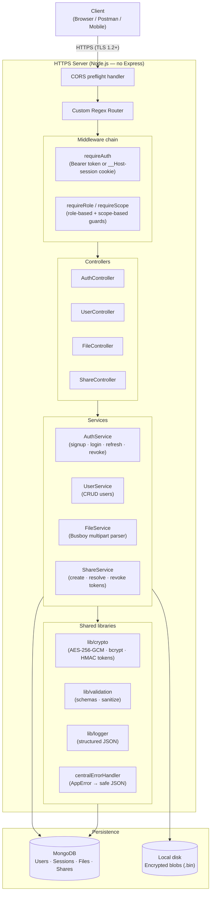
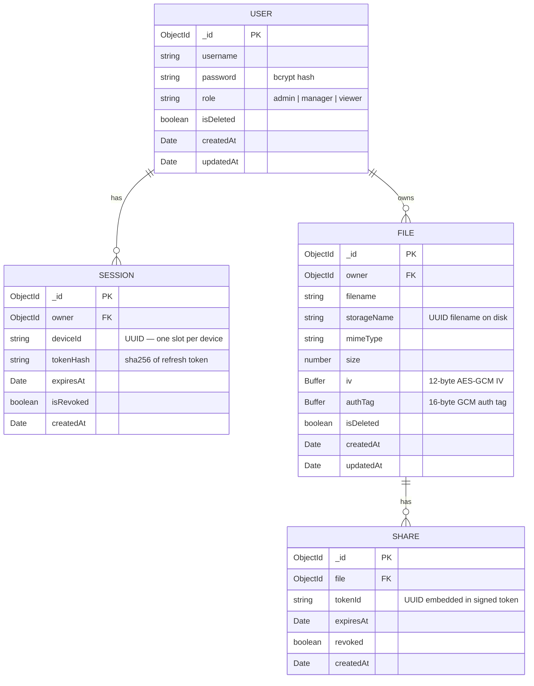

# SecureFileDrop

A self-hosted HTTPS API for securely uploading, encrypting, and sharing text and JSON files. Files are encrypted at rest using AES-256-GCM. Access is controlled by roles and scopes. Share links are time-limited and signed.

---

## Requirements

| Tool | Minimum version |
|------|----------------|
| Node.js | 20.6.0 |
| MongoDB | 6.0 |
| OpenSSL | any (for generating the TLS certificate) |

---

## First-time setup

### 1. Install dependencies

```bash
npm install
```

### 2. Install nodemon (for development)

```bash
npm install -g nodemon
```

### 3. Generate a self-signed TLS certificate

The server only runs over HTTPS. Run this once to create `cert/key.pem` and `cert/cert.pem`:

```bash
mkdir cert
openssl req -x509 -newkey rsa:4096 -keyout cert/key.pem -out cert/cert.pem -days 365 -nodes -subj "/CN=localhost"
```

### 4. Create the `.env` file

Copy the template below, then fill in the secret values:

```env
PORT=4433
MONGODB_URI=mongodb://localhost:27017/securefiledrop
SESSION_SECRET=<run keygen below>
SHARE_TOKEN_SECRET=<run keygen below>
FILE_ENCRYPTION_KEY=<run keygen below>
STORAGE_DIR=./storage
MAX_FILE_SIZE_BYTES=5242880
ALLOWED_ORIGIN=https://localhost:3000
SERVER_BASE_URL=https://localhost:4433
```

**Generate all three secrets at once:**

```bash
npm run keygen
```

Paste the output lines into your `.env` file.

### 5. Start MongoDB

Make sure MongoDB is running locally before starting the server:

```bash
# macOS / Linux (Homebrew)
brew services start mongodb-community

# Windows
net start MongoDB
```

---

## Running the server

**Development** (auto-restarts on file changes):

```bash
npm run dev
```

**Production:**

```bash
npm start
```

The server will be available at `https://localhost:4433`.

> Your browser will show a certificate warning because the cert is self-signed. In Postman, disable "SSL certificate verification" under Settings → General.

---

## Postman collection

A ready-to-use Postman collection (`Secure File Drop.postman_collection.json`) is included in the repository root. It covers every API endpoint with pre-filled request bodies and example variables.

**How to import:**

1. Open Postman → **Import** → select `Secure File Drop.postman_collection.json`
2. Set the collection variable `baseUrl` to `https://localhost:4433`
3. In Postman settings (Settings → General), turn off **SSL certificate verification** (required because the cert is self-signed)
4. Run **Sign Up** first to create a user, then **Login** — the collection auto-saves `accessToken` and `refreshToken` from the login response into collection variables, so every subsequent request is automatically authenticated

**Folder structure inside the collection:**

| Folder | Endpoints |
|--------|-----------|
| Auth | Signup, Login, Refresh, Logout |
| Users (Admin) | List users, Create user, Update user, Delete user, Get me |
| Files | Upload (single & multi), List, Get one, Delete |
| Sharing | Create share link, Download via share link (public), Revoke share link |

---

## Roles and permissions

| Role | Can do |
|------|--------|
| `admin` | Manage users (create / update / delete / list), read all files |
| `manager` | Upload files, read own files + shared files, create and revoke share links, delete own files |
| `viewer` | Read own files + shared files only |

The first admin user must be created directly via `POST /api/auth/signup` with `"role": "admin"`. After that, the admin can create further users through the user management endpoints.

**Scope mapping:**

| Role | Scopes |
|------|--------|
| `admin` | `file:read`, `file:write`, `file:delete` |
| `manager` | `file:read`, `file:write`, `file:delete` |
| `viewer` | `file:read` |

---

## API reference

All request and response bodies are JSON. Successful responses follow the shape:

```json
{ "success": true, "data": { ... } }
```

Error responses:

```json
{ "success": false, "error": "Human-readable message", "requestId": "uuid" }
```

---

### Authentication

#### Sign up
```
POST /api/auth/signup
```
```json
{ "username": "alice", "password": "s3cr3t", "role": "manager" }
```

#### Log in
```
POST /api/auth/login
```
```json
{ "username": "alice", "password": "s3cr3t" }
```
Returns `accessToken` (15 min), `refreshToken` (7 days), and sets a `__Host-session` cookie.  
Optionally send `X-Device-Id: <uuid>` header to track a specific device.

#### Refresh tokens
```
POST /api/auth/refresh
```
```json
{ "refreshToken": "<your refresh token>" }
```
Returns a new `accessToken` + `refreshToken` pair. The old refresh token is invalidated immediately.

#### Log out
```
POST /api/auth/logout
```
Send whichever credential you are using (Bearer header or cookie — see below).

---

### Authenticating requests

The server accepts **two authentication methods**. Use whichever fits your client — both work on every protected endpoint.

#### Option A — Bearer token (API clients, mobile apps, Postman)

After login, take the `accessToken` from the response body and send it as a header on every request:

```
Authorization: Bearer <accessToken>
```

Access tokens expire after **15 minutes**. When one expires, call `POST /api/auth/refresh` with your `refreshToken` to get a new pair without logging in again.

#### Option B — Session cookie (browsers)

After login, the server automatically sets a `__Host-session` cookie. Browsers send it back on every subsequent request with no extra work on your part. The cookie lasts **8 hours**.

> Both methods can coexist — a browser that also sends an `Authorization` header will use the Bearer token path.

---

### User management *(admin only)*

> All user management endpoints require authentication. Send either the `Authorization: Bearer <accessToken>` header or the session cookie.

| Method | Path | Description |
|--------|------|-------------|
| `GET` | `/api/users/me` | Get your own profile |
| `GET` | `/api/users` | List all active users |
| `POST` | `/api/users` | Create a user |
| `PATCH` | `/api/users/:id` | Update username / password / role |
| `DELETE` | `/api/users/:id` | Soft-delete a user (revokes all their sessions) |

**Create user body:**
```json
{ "username": "bob", "password": "p4ssw0rd", "role": "viewer" }
```

**Update user body** (all fields optional):
```json
{ "username": "bob2", "password": "newpass", "role": "manager" }
```

---

### Files

> All file endpoints require authentication. Send either the `Authorization: Bearer <accessToken>` header or let the browser send the session cookie automatically.

#### Upload one or more files
```
POST /api/files
Content-Type: multipart/form-data
```

For each file, send a **`meta` field before its `file` field**:

| Field | Type | Value |
|-------|------|-------|
| `meta` | Text | `{"filename":"notes.txt","mimeType":"text/plain","declaredSize":1234}` |
| `file` | File | the actual file |

Allowed `mimeType` values: `text/plain`, `application/json`.  
Maximum file size: 5 MB (configurable via `MAX_FILE_SIZE_BYTES`).

#### List files
```
GET /api/files
```
- **admin**: sees all non-deleted files (with `shareUrl` if a share link exists)
- **manager / viewer**: sees own files + files shared with them (with `shareUrl`)

#### Get a single file record
```
GET /api/files/:fileId
```

#### Delete a file *(owner only)*
```
DELETE /api/files/:fileId
```
Soft-deletes the file and revokes all its share links. The encrypted blob is kept on disk.

---

### Sharing

> Share endpoints require authentication except for the public download link.

#### Create a share link
```
POST /api/files/:fileId/share
```
```json
{ "expiresInSeconds": 3600 }
```
`expiresInSeconds` must be between 60 (1 minute) and 604800 (7 days).

Response includes:
```json
{
  "success": true,
  "data": {
    "token": "eyJ...",
    "shareUrl": "https://localhost:4433/api/share/eyJ..."
  }
}
```

#### Download via share link *(public — no auth required)*
```
GET /api/share/<token>
```
Returns the decrypted file as a download. The link expires at the time specified when it was created. No login needed — anyone with the link can download the file until it expires.

#### Revoke a share link *(owner only)*
```
DELETE /api/files/:fileId/share/:tokenId
```

---

## Architecture

### System overview



---

### Module / layer map

| Layer | Files | Responsibility |
|-------|-------|---------------|
| Entry | `server.js` | HTTPS server bootstrap, MongoDB connect, signal handlers |
| Config | `config/env.js`, `config/auth.js`, `config/routes.js` | Env validation, token TTLs, role→scope map, route table |
| Middleware | `middleware/session.js`, `middleware/rbac.js`, `middleware/errorHandler.js` | Auth (Bearer + cookie), role/scope guards, central error sink |
| Controllers | `api/*/Controller.js` (×4) | Parse request, call service, send response |
| Services | `api/*/Service.js` (×4) | Business logic — auth, user CRUD, file encrypt/upload, share tokens |
| Models | `api/*/Model.js` (×4) | Mongoose schemas for User, Session, File, Share |
| Crypto | `lib/crypto/fileCrypto.js`, `tokens.js`, `password.js` | AES-256-GCM streams, HMAC sign/verify, bcrypt |
| Validation | `lib/validation/schemas.js`, `sanitize.js` | JSON schema validators, input sanitization, path traversal guard |
| HTTP helpers | `lib/http.js` | `readJsonBody`, `sendJson`, cookie serialization, CORS preflight |
| Infrastructure | `lib/logger.js`, `lib/router.js`, `lib/perf.js`, `lib/shutdown.js` | Structured JSON logging, custom regex router, timing, graceful shutdown |

---

### Authentication flow — login

```mermaid
sequenceDiagram
    participant C as Client
    participant AC as AuthController
    participant AS as AuthService
    participant DB as MongoDB
    participant Crypto as lib/crypto

    C->>AC: POST /api/auth/login\n{username, password}
    AC->>AC: sanitizeBody() + validate(SCHEMAS.login)
    AC->>AS: loginAll({username, password}, deviceId?)

    AS->>DB: UserModel.findOne({username, isDeleted:false})
    DB-->>AS: user doc (with hashed password)
    AS->>Crypto: verifyPassword(plain, hash) — bcrypt
    Crypto-->>AS: true / false

    alt Invalid credentials
        AS-->>AC: throw AppError(401)
        AC-->>C: 401 {error, requestId}
    end

    AS->>Crypto: signToken(cookiePayload, SESSION_SECRET) — HMAC
    AS->>Crypto: signToken(accessPayload,  SESSION_SECRET) — 15 min
    AS->>Crypto: signToken(refreshPayload, SESSION_SECRET) — 7 days
    AS->>AS: enforceSessionLimit(userId, deviceId)
    AS->>DB: SessionModel.findOneAndUpdate(upsert)\n{tokenHash: sha256(refreshToken), expiresAt}
    DB-->>AS: session saved

    AS-->>AC: {cookieToken, accessToken, refreshToken, scopes}
    AC->>C: Set-Cookie: __Host-session=<cookieToken>; HttpOnly; Secure; SameSite=Strict
    AC-->>C: 200 {accessToken, refreshToken, expiresIn, scopes}
```

---

### Token refresh & reuse detection

`POST /api/auth/refresh` accepts a `refreshToken` string and returns a new `accessToken` + `refreshToken` pair. The old refresh token is immediately invalidated (token rotation).

Steps performed on each refresh:

1. **HMAC signature verify** — `verifyToken(rawRefreshToken, SESSION_SECRET)` checks the signature with `timingSafeEqual` and validates the `exp` claim.
2. **Session lookup** — `SessionModel.findOne({ owner: uid, deviceId })` checks that a DB record exists.
3. **Hash comparison** — `sha256(rawRefreshToken)` is compared against the stored `tokenHash`. A mismatch means the token was already rotated, indicating a **stolen token reuse attempt**.
4. **Breach response** — on reuse detection, `SessionModel.updateMany({ owner: uid }, { isRevoked: true })` nukes all active sessions for that user and returns `401 Compromised token detected`.
5. **Token rotation** — new `accessToken` (15 min) and `refreshToken` (7 days) are issued; the session row is updated with the new hash and expiry.

---

### Request middleware chain

Every incoming request passes through this chain in order:

1. **CORS preflight** — `OPTIONS` requests are answered immediately with `204`; all others continue.
2. **Custom regex router** — matches `method + path` against the route table. Returns `404` if no match.
3. **`requireAuth`** — checks for an `Authorization: Bearer <token>` header first; falls back to the `__Host-session` cookie. Calls `verifyToken` (HMAC + `timingSafeEqual`). Sets `req.user = { uid, role, scopes, deviceId }` on success. Returns `401` if neither credential is present or valid.
4. **`requireRole(…)` / `requireScope(…)`** — checks `req.user.role` or `req.user.scopes` against the route's requirements. Returns `403` on mismatch.
5. **Controller** — parses the request, calls the service layer, and calls `sendJson` with the result.
6. **`centralErrorHandler`** — any `throw` from any handler lands here. Generates a `requestId`, logs the error, and sends a safe JSON error response (stack is never exposed).

---

### File upload flow

`POST /api/files` accepts `multipart/form-data`. Each file requires a `meta` field immediately before its `file` field (up to 10 pairs per request). Processing is **best-effort** — one failing file does not abort the others.

Steps per file:

1. **`meta` field parsed** — `JSON.parse` + `validate(SCHEMAS.fileMeta)` checks `filename`, `mimeType` (must be `text/plain` or `application/json`), `declaredSize`.
2. **Path safety** — `assertSafePath` guards against path traversal; the on-disk name is a random UUID.
3. **First-chunk content sniffing** — `looksLikeText(chunk)` inspects bytes for null bytes, invalid C0/C1 control chars, and invalid UTF-8 sequences. Rejects with `415` if the content does not match the declared `mimeType`.
4. **Encrypt stream** — `createEncryptStream()` creates an AES-256-GCM cipher with a fresh random 12-byte IV. The pipeline is `fileStream → cipher → writeStream`.
5. **Size limit** — Busboy fires a `limit` event if the file exceeds `MAX_FILE_SIZE_BYTES`; the file is rejected with `413` and the stream is drained to prevent socket stalls.
6. **DB record** — on `dest finish`, `FileModel.create` saves `{ owner, filename, storageName, mimeType, size, iv, authTag }`. The `iv` and `authTag` are required for later decryption.
7. **Response** — `201` (all succeeded), `207` (partial), or `400` (all failed). Each entry in the response array carries `{ success, file | error }`.

---

### File download via share link

```mermaid
sequenceDiagram
    participant Anyone as Anyone (no auth needed)
    participant SC as ShareController
    participant SS as ShareService
    participant Crypto as AES-256-GCM decipher stream
    participant Disk as Local disk (storage/)
    participant DB as MongoDB

    Anyone->>SC: GET /api/share/<token>
    SC->>SS: resolveShareToken(rawToken)

    SS->>SS: verifyToken(rawToken, SHARE_TOKEN_SECRET)\nHMAC signature + exp check
    
    alt Invalid signature or expired JWT claim
        SS-->>Anyone: 401 Token invalid or expired
    end

    SS->>DB: ShareModel.findOne({tokenId, revoked:false})

    alt Not found or revoked
        SS-->>Anyone: 401 Token invalid or expired
    end

    DB-->>SS: share doc {expiresAt}
    SS->>SS: share.expiresAt < now?

    alt Expired in DB
        SS-->>Anyone: 401 Token invalid or expired
    end

    SS->>DB: FileModel.findOne({_id:fileId, isDeleted:false})
    DB-->>SS: file doc {storageName, iv, authTag, mimeType, filename}
    SS-->>SC: file doc

    SC->>Disk: createReadStream(storage/storageName)
    SC->>Crypto: createDecryptStream(iv, authTag)\naes-256-gcm decipher
    SC->>Anyone: Content-Disposition: attachment; filename="…"\nContent-Type: mimeType\nreadStream.pipe(decipher).pipe(res)
```

---

### Error handling

All errors flow through `centralErrorHandler(err, req, res)` in `middleware/errorHandler.js`. There are two error classes:

- **`AppError` (operational)** — thrown intentionally by controllers and services for known bad inputs, auth failures, permission denials, etc. `isOperational = true`. The `err.message` is safe to send to the client. Logged at `WARN` level.
- **Unexpected errors** — unhandled JS exceptions, DB driver crashes, etc. `isOperational = false` (default). The message is replaced with `"Internal server error"` — the stack is never sent to the client. Logged at `ERROR` level with full stack.

Every error response includes a `requestId` (UUID) so errors can be correlated with server logs.

**Error catalogue:**

| Status | Thrown when |
|--------|-------------|
| 400 | Malformed JSON, missing required fields, invalid meta, no files in upload |
| 401 | No token/cookie, invalid signature, expired token, wrong token type, refresh reuse |
| 403 | Role too low (`requireRole`), missing scope (`requireScope`) |
| 404 | File not found, share token not in DB, user not found |
| 409 | Username already taken |
| 413 | File exceeds `MAX_FILE_SIZE_BYTES`, too many files per request |
| 415 | File content does not match declared `mimeType` |
| 500 | Unexpected errors (DB crash, disk error, etc.) — stack hidden from client |

---

### Session & token lifetime

```mermaid
gantt
    title Token / session lifetimes (not to scale)
    dateFormat  X
    axisFormat  %s

    section Bearer path
    Access token (15 min)       : 0, 900
    Refresh token (7 days)      : 0, 604800

    section Cookie path
    __Host-session cookie (8 h) : 0, 28800

    section Limits
    Max 2 concurrent sessions per user (all devices) : milestone, 0, 0
```



- **Access token** — stateless JWT-like HMAC token; no DB lookup on every request.
- **Refresh token** — DB-backed; SHA-256 hash stored in `SessionModel`. Token rotation on every use.
- **Cookie token** — long-lived, same secret as access token; verified entirely from signature.
- **Session cap** — `MAX_SESSIONS = 2` per user. Oldest session is evicted when cap is reached.
- **Reuse detection** — if a refresh token is used twice, all sessions for that user are immediately revoked.

---

### Data models



---

## Environment variables reference

| Variable | Required | Description |
|----------|----------|-------------|
| `PORT` | No | Port to listen on (default: `4433`) |
| `MONGODB_URI` | Yes | MongoDB connection string |
| `SESSION_SECRET` | Yes | 64-char hex — signs session and access/refresh tokens |
| `SHARE_TOKEN_SECRET` | Yes | 64-char hex — signs share link tokens |
| `FILE_ENCRYPTION_KEY` | Yes | 64-char hex — AES-256-GCM key for file encryption |
| `STORAGE_DIR` | Yes | Path to directory where encrypted files are stored |
| `MAX_FILE_SIZE_BYTES` | Yes | Maximum upload size in bytes (e.g. `5242880` = 5 MB) |
| `ALLOWED_ORIGIN` | No | CORS allowed origin (default: `https://localhost:3000`) |
| `SERVER_BASE_URL` | No | Base URL used in share links (default: `https://localhost:<PORT>`) |
| `LOG_LEVEL` | No | Log verbosity: `DEBUG`, `INFO`, `WARN`, `ERROR` (default: `DEBUG` in dev, `INFO` in prod) |

---

## Project structure

```
.
├── api/
│   ├── auth/          AuthController, AuthService, SessionModel
│   ├── file/          FileController, FileService, FileModel
│   ├── share/         ShareController, ShareService, ShareModel
│   └── user/          UserController, UserService, UserModel
├── cert/              TLS key and certificate (git-ignored)
├── config/
│   ├── auth.js        Token TTLs, role→scope mapping, MAX_SESSIONS
│   ├── env.js         Environment variable loader and validator
│   └── routes.js      All API routes with middleware chains
├── lib/
│   ├── crypto/
│   │   ├── fileCrypto.js   AES-256-GCM encrypt/decrypt streams
│   │   ├── password.js     bcrypt hash + verify
│   │   └── tokens.js       HMAC sign + verify (timingSafeEqual)
│   ├── validation/
│   │   ├── schemas.js      JSON schema validators
│   │   └── sanitize.js     Input sanitization, path traversal guard
│   ├── http.js        readJsonBody, sendJson, cookie helpers, CORS
│   ├── logger.js      Structured JSON logger (no external deps)
│   ├── perf.js        Async timing helper
│   ├── router.js      Custom regex-based HTTP router
│   └── shutdown.js    Graceful SIGTERM/SIGINT shutdown
├── middleware/
│   ├── errorHandler.js    AppError class + centralErrorHandler
│   ├── rbac.js            requireRole, requireScope guards
│   └── session.js         requireAuth — Bearer token + cookie
├── storage/           Encrypted file blobs (git-ignored)
├── Secure File Drop.postman_collection.json
├── .env               Secret configuration (git-ignored)
└── server.js          Entry point — HTTPS server + MongoDB connect
```
