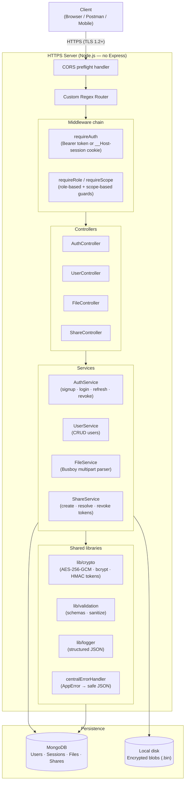
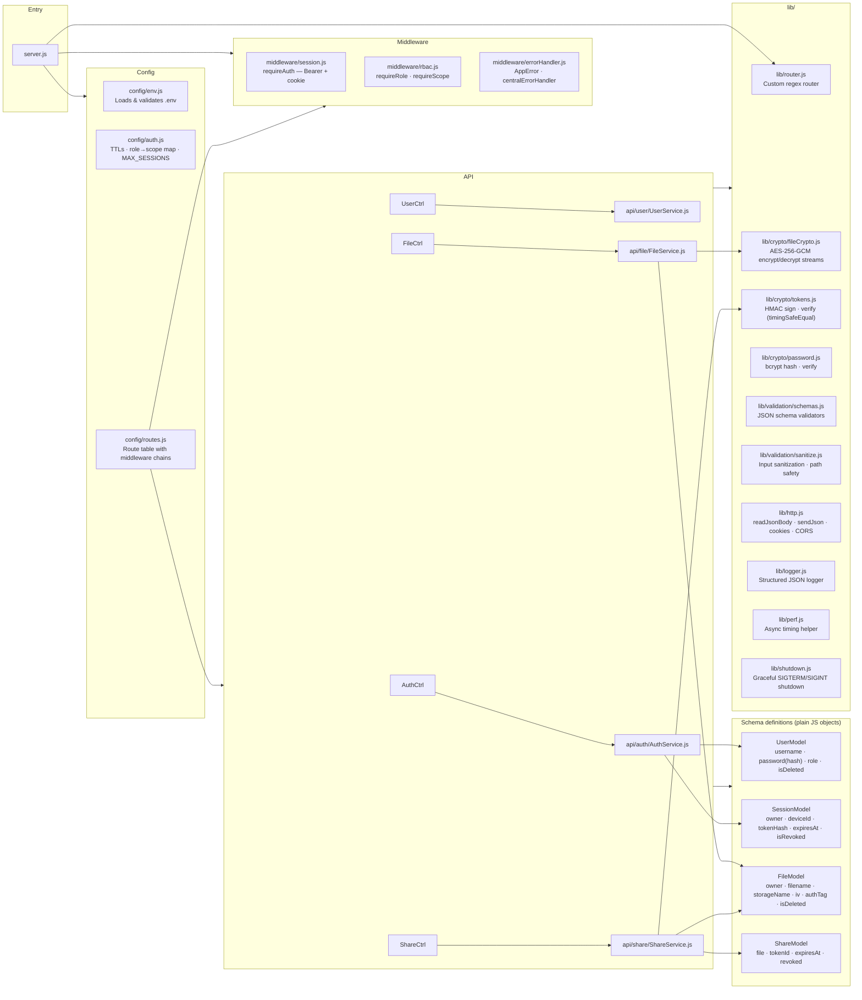
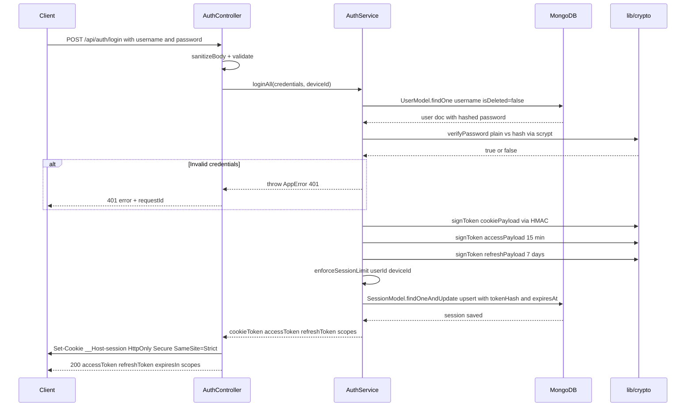
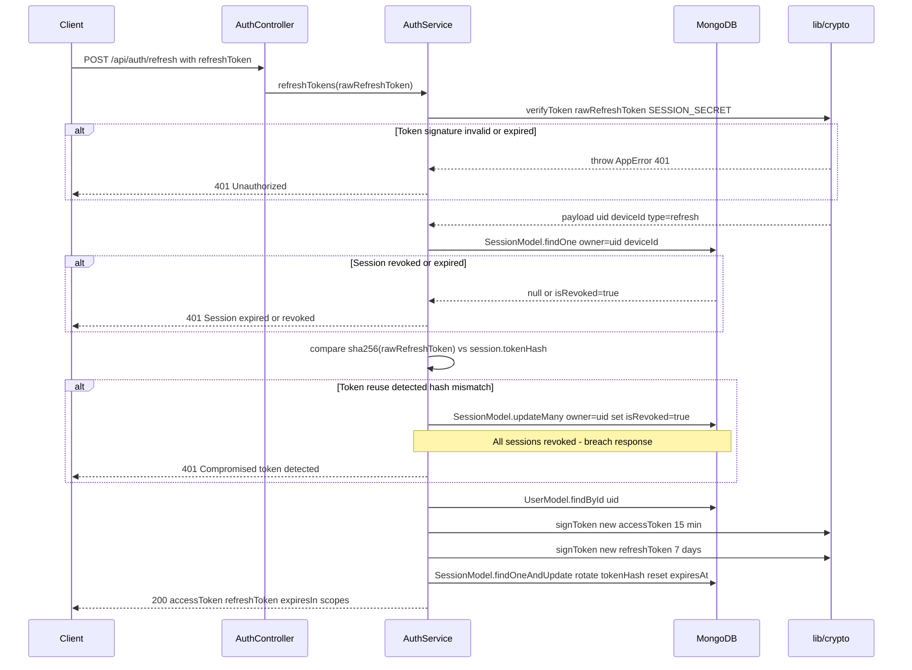
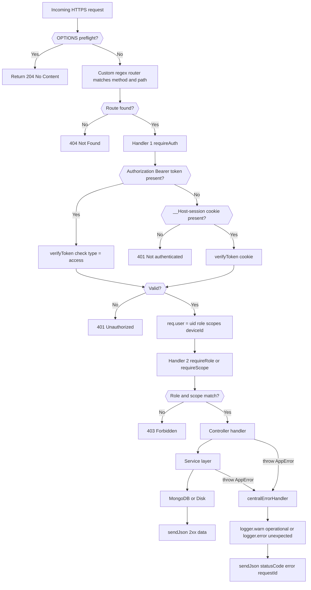
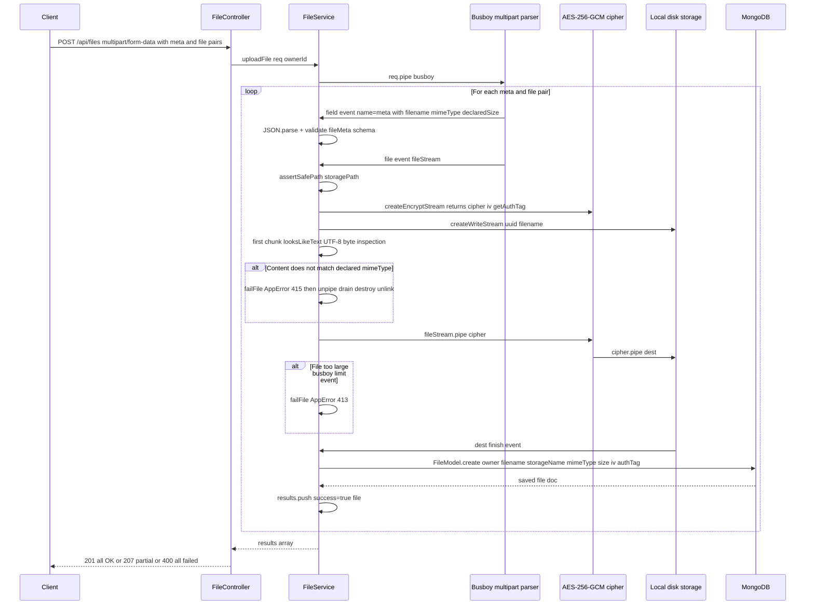
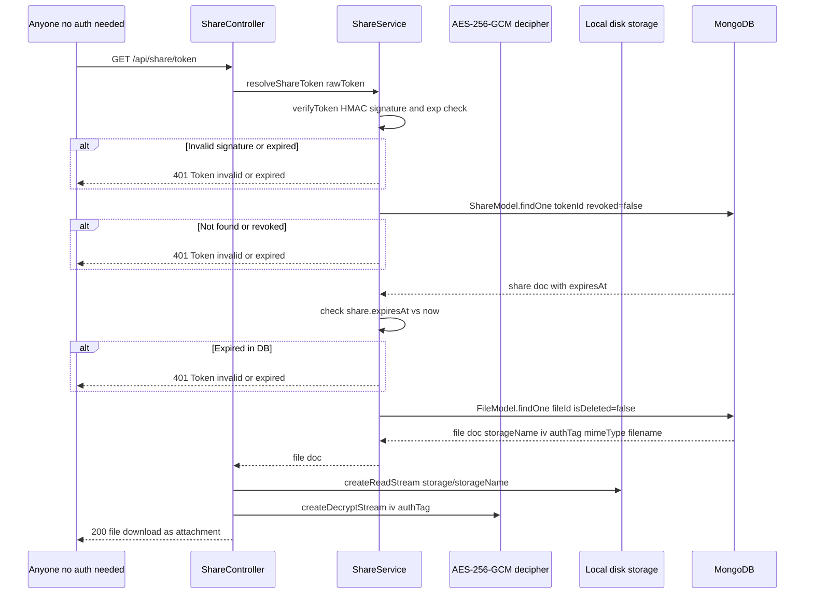
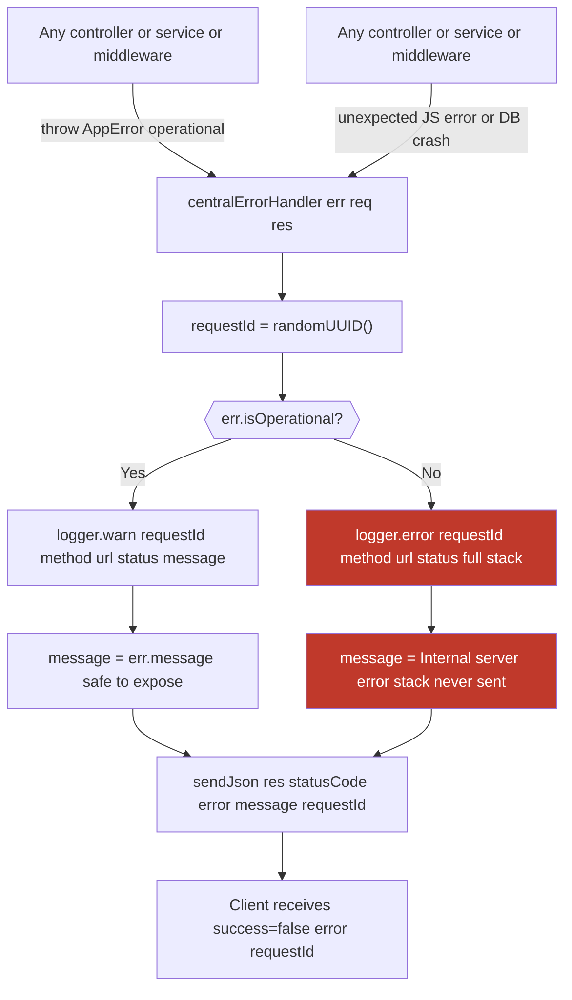
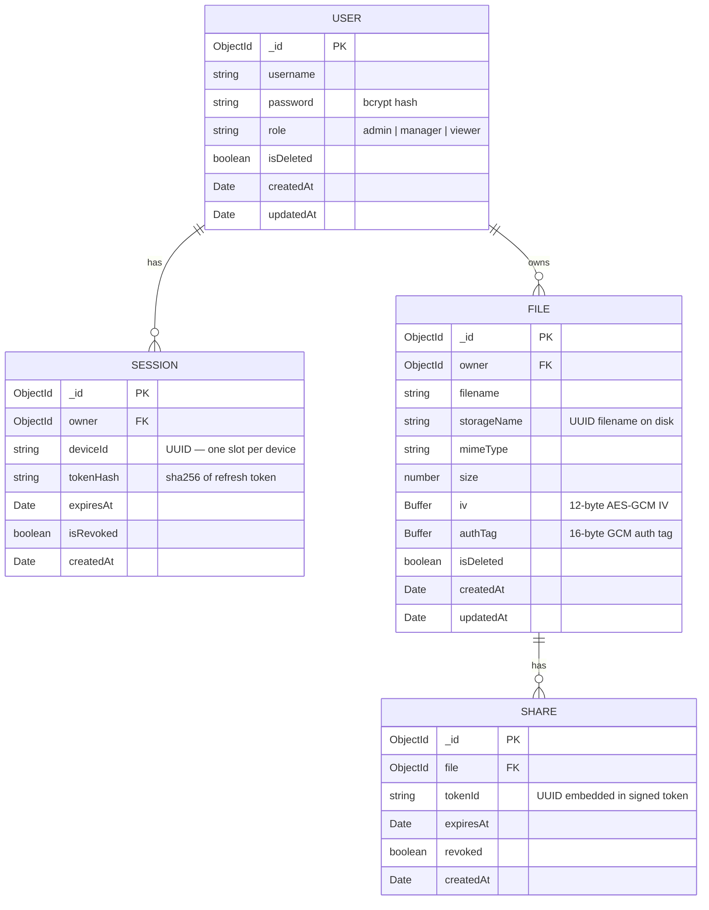

# SecureFileDrop

A self-hosted HTTPS API for securely uploading, encrypting, and sharing text and JSON files. Files are encrypted at rest using AES-256-GCM. Access is controlled by roles and scopes. Share links are time-limited and signed.

---

## Requirements

| Tool | Minimum version |
|------|----------------|
| Node.js | 20.6.0 |
| MongoDB | 6.0 |
| OpenSSL | any (for generating the TLS certificate) |

---

## First-time setup

### 1. Install dependencies

```bash
npm install
```

### 2. Install nodemon (for development)

```bash
npm install -g nodemon
```

### 3. Generate a self-signed TLS certificate

The server only runs over HTTPS. Run this once to create `cert/key.pem` and `cert/cert.pem`:

```bash
mkdir cert
openssl req -x509 -newkey rsa:4096 -keyout cert/key.pem -out cert/cert.pem -days 365 -nodes -subj "/CN=localhost"
```

### 4. Create the `.env` file

Copy the template below, then fill in the secret values:

```env
PORT=4433
MONGODB_URI=mongodb://localhost:27017/securefiledrop
SESSION_SECRET=<run keygen below>
SHARE_TOKEN_SECRET=<run keygen below>
FILE_ENCRYPTION_KEY=<run keygen below>
STORAGE_DIR=./storage
MAX_FILE_SIZE_BYTES=5242880
ALLOWED_ORIGIN=https://localhost:3000
SERVER_BASE_URL=https://localhost:4433
```

**Generate all three secrets at once:**

```bash
npm run keygen
```

Paste the output lines into your `.env` file.

### 5. Start MongoDB

Make sure MongoDB is running locally before starting the server:

```bash
# macOS / Linux (Homebrew)
brew services start mongodb-community

# Windows
net start MongoDB
```

---

## Running the server

**Development** (auto-restarts on file changes):

```bash
npm run dev
```

**Production:**

```bash
npm start
```

The server will be available at `https://localhost:4433`.

> Your browser will show a certificate warning because the cert is self-signed. In Postman, disable "SSL certificate verification" under Settings → General.

---

## Postman collection

A ready-to-use Postman collection (`Secure File Drop.postman_collection.json`) is included in the repository root. It covers every API endpoint with pre-filled request bodies and example variables.

**How to import:**

1. Open Postman → **Import** → select `Secure File Drop.postman_collection.json`
2. Set the collection variable `baseUrl` to `https://localhost:4433`
3. In Postman settings (Settings → General), turn off **SSL certificate verification** (required because the cert is self-signed)
4. Run **Sign Up** first to create a user, then **Login** — the collection auto-saves `accessToken` and `refreshToken` from the login response into collection variables, so every subsequent request is automatically authenticated

**Folder structure inside the collection:**

| Folder | Endpoints |
|--------|-----------|
| Auth | Signup, Login, Refresh, Logout |
| Users (Admin) | List users, Create user, Update user, Delete user, Get me |
| Files | Upload (single & multi), List, Get one, Delete |
| Sharing | Create share link, Download via share link (public), Revoke share link |

---

## Roles and permissions

| Role | Can do |
|------|--------|
| `admin` | Manage users (create / update / delete / list), read all files |
| `manager` | Upload files, read own files + shared files, create and revoke share links, delete own files |
| `viewer` | Read own files + shared files only |

The first admin user must be created directly via `POST /api/auth/signup` with `"role": "admin"`. After that, the admin can create further users through the user management endpoints.

**Scope mapping:**

| Role | Scopes |
|------|--------|
| `admin` | `file:read`, `file:write`, `file:delete` |
| `manager` | `file:read`, `file:write`, `file:delete` |
| `viewer` | `file:read` |

---

## API reference

All request and response bodies are JSON. Successful responses follow the shape:

```json
{ "success": true, "data": { ... } }
```

Error responses:

```json
{ "success": false, "error": "Human-readable message", "requestId": "uuid" }
```

---

### Authentication

#### Sign up
```
POST /api/auth/signup
```
```json
{ "username": "alice", "password": "s3cr3t", "role": "manager" }
```

#### Log in
```
POST /api/auth/login
```
```json
{ "username": "alice", "password": "s3cr3t" }
```
Returns `accessToken` (15 min), `refreshToken` (7 days), and sets a `__Host-session` cookie.  
Optionally send `X-Device-Id: <uuid>` header to track a specific device.

#### Refresh tokens
```
POST /api/auth/refresh
```
```json
{ "refreshToken": "<your refresh token>" }
```
Returns a new `accessToken` + `refreshToken` pair. The old refresh token is invalidated immediately.

#### Log out
```
POST /api/auth/logout
```
Send whichever credential you are using (Bearer header or cookie — see below).

---

### Authenticating requests

The server accepts **two authentication methods**. Use whichever fits your client — both work on every protected endpoint.

#### Option A — Bearer token (API clients, mobile apps, Postman)

After login, take the `accessToken` from the response body and send it as a header on every request:

```
Authorization: Bearer <accessToken>
```

Access tokens expire after **15 minutes**. When one expires, call `POST /api/auth/refresh` with your `refreshToken` to get a new pair without logging in again.

#### Option B — Session cookie (browsers)

After login, the server automatically sets a `__Host-session` cookie. Browsers send it back on every subsequent request with no extra work on your part. The cookie lasts **8 hours**.

> Both methods can coexist — a browser that also sends an `Authorization` header will use the Bearer token path.

---

### User management *(admin only)*

> All user management endpoints require authentication. Send either the `Authorization: Bearer <accessToken>` header or the session cookie.

| Method | Path | Description |
|--------|------|-------------|
| `GET` | `/api/users/me` | Get your own profile |
| `GET` | `/api/users` | List all active users |
| `POST` | `/api/users` | Create a user |
| `PATCH` | `/api/users/:id` | Update username / password / role |
| `DELETE` | `/api/users/:id` | Soft-delete a user (revokes all their sessions) |

**Create user body:**
```json
{ "username": "bob", "password": "p4ssw0rd", "role": "viewer" }
```

**Update user body** (all fields optional):
```json
{ "username": "bob2", "password": "newpass", "role": "manager" }
```

---

### Files

> All file endpoints require authentication. Send either the `Authorization: Bearer <accessToken>` header or let the browser send the session cookie automatically.

#### Upload one or more files
```
POST /api/files
Content-Type: multipart/form-data
```

For each file, send a **`meta` field before its `file` field**:

| Field | Type | Value |
|-------|------|-------|
| `meta` | Text | `{"filename":"notes.txt","mimeType":"text/plain","declaredSize":1234}` |
| `file` | File | the actual file |

Allowed `mimeType` values: `text/plain`, `application/json`.  
Maximum file size: 5 MB (configurable via `MAX_FILE_SIZE_BYTES`).

#### List files
```
GET /api/files
```
- **admin**: sees all non-deleted files (with `shareUrl` if a share link exists)
- **manager / viewer**: sees own files + files shared with them (with `shareUrl`)

#### Get a single file record
```
GET /api/files/:fileId
```

#### Delete a file *(owner only)*
```
DELETE /api/files/:fileId
```
Soft-deletes the file and revokes all its share links. The encrypted blob is kept on disk.

---

### Sharing

> Share endpoints require authentication except for the public download link.

#### Create a share link
```
POST /api/files/:fileId/share
```
```json
{ "expiresInSeconds": 3600 }
```
`expiresInSeconds` must be between 60 (1 minute) and 604800 (7 days).

Response includes `tokenId` — **store it** if you need to revoke the link later:
```json
{
  "success": true,
  "data": {
    "token": "eyJ...",
    "tokenId": "5b61efda-2b58-4247-b541-fdd6b37c8d15",
    "shareUrl": "https://localhost:4433/api/share/eyJ..."
  }
}
```

#### List active share tokens for a file
```
GET /api/files/:fileId/share
```
- **admin**: lists tokens for any file
- **manager / viewer**: only for files they own

Response:
```json
{
  "success": true,
  "data": {
    "tokens": [
      { "tokenId": "5b61efda-...", "expiresAt": "2026-08-24T...", "createdAt": "2026-08-23T..." }
    ]
  }
}
```
Use this endpoint to retrieve `tokenId`s if you did not persist them at creation time.

#### Download via share link *(public — no auth required)*
```
GET /api/share/<token>
```
Returns the decrypted file as a download. The link expires at the time specified when it was created. No login needed — anyone with the link can download the file until it expires.

#### Revoke a share link
```
DELETE /api/files/:fileId/share/:tokenId
```
- **admin**: can revoke tokens on any file (`file:delete` scope)
- **file owner**: can revoke tokens on their own files (`file:delete` scope)

---

## Architecture

### System overview



---

### Module / layer map



---

### Authentication flow — login



---

### Token refresh & reuse detection



---

### Request middleware chain



---

### File upload flow



---

### File download via share link



---

### Error handling



**Error catalogue:**

| Status | Thrown when |
|--------|-------------|
| 400 | Malformed JSON, missing required fields, invalid meta, no files in upload |
| 401 | No token/cookie, invalid signature, expired token, wrong token type, refresh reuse |
| 403 | Role too low (`requireRole`), missing scope (`requireScope`) |
| 404 | File not found, share token not in DB, user not found |
| 409 | Username already taken |
| 413 | File exceeds `MAX_FILE_SIZE_BYTES`, too many files per request |
| 415 | File content does not match declared `mimeType` |
| 500 | Unexpected errors (DB crash, disk error, etc.) — stack hidden from client |

---

### Session & token lifetime

```mermaid
gantt
    title Token and session lifetimes (not to scale)
    dateFormat X
    axisFormat %s

    section Bearer path
    Access token 15 min      : 0, 900
    Refresh token 7 days     : 0, 604800

    section Cookie path
    Session cookie 8 hours   : 0, 28800
```



- **Access token** — stateless JWT-like HMAC token; no DB lookup on every request.
- **Refresh token** — DB-backed; SHA-256 hash stored in `SessionModel`. Token rotation on every use.
- **Cookie token** — long-lived, same secret as access token; verified entirely from signature.
- **Session cap** — `MAX_SESSIONS = 2` per user. Oldest session is evicted when cap is reached.
- **Reuse detection** — if a refresh token is used twice, all sessions for that user are immediately revoked.

---

### Data models



---

## Environment variables reference

| Variable | Required | Default | Description |
|----------|----------|---------|-------------|
| `PORT` | No | `4433` | Port to listen on |
| `MONGODB_URI` | Yes | — | MongoDB connection string |
| `SESSION_SECRET` | Yes | — | 64-char hex — signs session and access/refresh tokens |
| `SHARE_TOKEN_SECRET` | Yes | — | 64-char hex — signs share link tokens |
| `FILE_ENCRYPTION_KEY` | Yes | — | 64-char hex — AES-256-GCM key for file encryption |
| `STORAGE_DIR` | Yes | — | Path to directory where encrypted files are stored |
| `MAX_FILE_SIZE_BYTES` | Yes | — | Maximum upload size in bytes (e.g. `5242880` = 5 MB) |
| `ALLOWED_ORIGIN` | No | `https://localhost:3000` | CORS allowed origin |
| `SERVER_BASE_URL` | No | `https://localhost:<PORT>` | Base URL used in share links |
| `LOG_LEVEL` | No | `DEBUG` (dev) / `INFO` (prod) | Log verbosity: `DEBUG`, `INFO`, `WARN`, `ERROR` |
| `COOKIE_TTL_SECONDS` | No | `28800` (8 h) | Lifetime of the `__Host-session` cookie |
| `ACCESS_TTL_SECONDS` | No | `900` (15 min) | Lifetime of a Bearer access token |
| `REFRESH_TTL_SECONDS` | No | `604800` (7 d) | Lifetime of a Bearer refresh token |
| `MAX_SESSIONS` | No | `2` | Max concurrent active sessions per user |
| `MAX_FILES_PER_UPLOAD` | No | `10` | Max files per multipart upload request |
| `SHARE_TOKEN_MIN_EXPIRY` | No | `60` | Minimum share token expiry (seconds) |
| `SHARE_TOKEN_MAX_EXPIRY` | No | `604800` | Maximum share token expiry (seconds) |
| `SHUTDOWN_TIMEOUT_MS` | No | `10000` | Grace period before force-closing active streams on shutdown |

---

## Project structure

```
.
├── api/
│   ├── auth/          AuthController, AuthService, SessionModel
│   ├── file/          FileController, FileService, FileModel
│   ├── share/         ShareController, ShareService, ShareModel
│   └── user/          UserController, UserService, UserModel
├── cert/              TLS key and certificate (git-ignored)
├── config/
│   ├── auth.js        Token TTLs, role→scope mapping, MAX_SESSIONS
│   ├── env.js         Environment variable loader and validator
│   └── routes.js      All API routes with middleware chains
├── lib/
│   ├── crypto/
│   │   ├── fileCrypto.js   AES-256-GCM encrypt/decrypt streams
│   │   ├── password.js     bcrypt hash + verify
│   │   └── tokens.js       HMAC sign + verify (timingSafeEqual)
│   ├── validation/
│   │   ├── schemas.js      JSON schema validators
│   │   └── sanitize.js     Input sanitization, path traversal guard
│   ├── http.js        readJsonBody, sendJson, cookie helpers, CORS
│   ├── logger.js      Structured JSON logger (no external deps)
│   ├── perf.js        Async timing helper
│   ├── router.js      Custom regex-based HTTP router
│   └── shutdown.js    Graceful SIGTERM/SIGINT shutdown
├── middleware/
│   ├── errorHandler.js    AppError class + centralErrorHandler
│   ├── rbac.js            requireRole, requireScope guards
│   └── session.js         requireAuth — Bearer token + cookie
├── storage/           Encrypted file blobs (git-ignored)
├── Secure File Drop.postman_collection.json
├── .env               Secret configuration (git-ignored)
└── server.js          Entry point — HTTPS server + MongoDB connect
```

---

## Indexes

Every query-hot field has an index created automatically at startup via `ensureIndexes()` in `lib/db.js`.

| Collection | Index | Type | Helps |
|------------|-------|------|-------|
| `users` | `{ username: 1 }` | unique | O(log n) login lookup; duplicate-username rejection |
| `sessions` | `{ owner: 1, deviceId: 1 }` | unique | Session upsert on every login / refresh with no full scan |
| `sessions` | `{ owner: 1, isRevoked: 1, expiresAt: 1 }` | compound | `enforceSessionLimit` avoids a full collection scan |
| `files` | `{ owner: 1, isDeleted: 1 }` | compound | File list filtered by owner without collection scan |
| `sharetokens` | `{ tokenId: 1 }` | unique | O(1) token resolve; prevents duplicate token IDs |
| `sharetokens` | `{ file: 1, revoked: 1, expiresAt: 1 }` | compound | Active-share check when building the file list |

---

## Session cookies vs Bearer access tokens — security perspective

Both authentication methods are supported simultaneously. Here is why each exists and what protects it.

### Session cookie (`__Host-session`)

| Property | Value | Why it matters |
|----------|-------|----------------|
| `HttpOnly` | ✓ | JavaScript (including XSS payloads) cannot read the cookie value |
| `Secure` | ✓ | Cookie is never sent over plain HTTP — HTTPS only |
| `SameSite=Strict` | ✓ | Cookie is not sent on cross-site requests, blocking CSRF attacks |
| `__Host-` prefix | ✓ | Browser enforces `Secure` and `Path=/`; cookie cannot be scoped to a subdomain |
| Lifetime | 8 hours | Short enough to limit the exposure window if a cookie is somehow leaked |

The cookie contains a **signed, time-limited HMAC token** (not a session ID). The server is stateless on the cookie path — no DB lookup is needed to verify a cookie request.

### Bearer access token

| Property | Value | Why it matters |
|----------|-------|----------------|
| Lifetime | 15 minutes | Even if a token is intercepted, it expires quickly |
| Signed with HMAC-SHA256 | ✓ | Cannot be forged without `SESSION_SECRET` |
| Carries `uid`, `role`, `scopes`, `deviceId` | ✓ | No DB lookup needed on each request (stateless) |
| Transmitted in header, not cookie | ✓ | Not affected by CSRF; mobile/SPA clients can store it in memory |

### Refresh token

| Property | Value | Why it matters |
|----------|-------|----------------|
| Lifetime | 7 days | Long-lived so users are not constantly re-logging in |
| DB-backed (hash stored in `sessions`) | ✓ | Can be revoked immediately; never stored in plain text |
| Rotated on every use | ✓ | If a refresh token is stolen and used by an attacker, the legitimate client's next refresh detects a hash mismatch |
| Reuse triggers global revocation | ✓ | The server immediately revokes **all** sessions for that user — breach response |
| SHA-256 hash stored (not token itself) | ✓ | A DB breach does not expose usable tokens |

