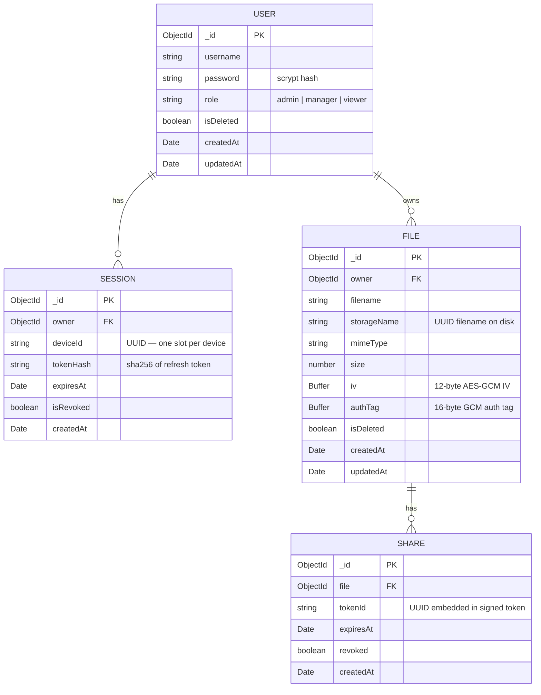

# Data Models

```mermaid
erDiagram
    USER {
        ObjectId _id PK
        string   username
        string   password "scrypt hash"
        string   role "admin | manager | viewer"
        boolean  isDeleted
        Date     createdAt
        Date     updatedAt
    }

    SESSION {
        ObjectId _id PK
        ObjectId owner FK
        string   deviceId "UUID — one slot per device"
        string   tokenHash "sha256 of refresh token"
        Date     expiresAt
        boolean  isRevoked
        Date     createdAt
    }

    FILE {
        ObjectId _id PK
        ObjectId owner FK
        string   filename
        string   storageName "UUID filename on disk"
        string   mimeType
        number   size
        Buffer   iv "12-byte AES-GCM IV"
        Buffer   authTag "16-byte GCM auth tag"
        boolean  isDeleted
        Date     createdAt
        Date     updatedAt
    }

    SHARE {
        ObjectId _id PK
        ObjectId file FK
        string   tokenId "UUID embedded in signed token"
        Date     expiresAt
        boolean  revoked
        Date     createdAt
    }

    USER ||--o{ SESSION : "has"
    USER ||--o{ FILE    : "owns"
    FILE ||--o{ SHARE   : "has"
```
