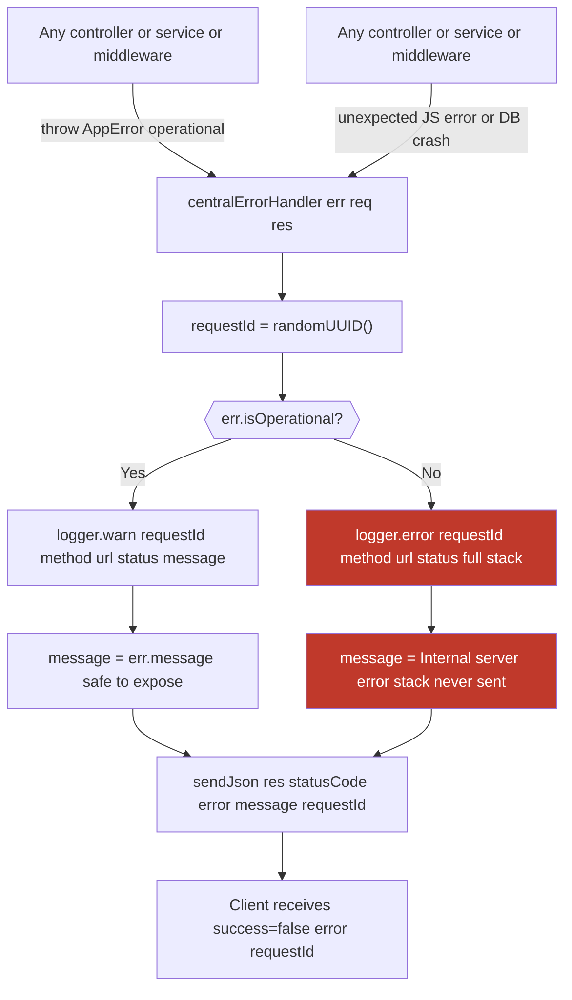

# Error Handling

**Error catalogue:**

| Status | Thrown when |
|--------|-------------|
| 400 | Malformed JSON, missing required fields, invalid meta, no files in upload |
| 401 | No token/cookie, invalid signature, expired token, wrong token type, refresh reuse |
| 403 | Role too low (`requireRole`), missing scope (`requireScope`) |
| 404 | File not found, share token not in DB, user not found |
| 409 | Username already taken |
| 413 | File exceeds `MAX_FILE_SIZE_BYTES`, too many files per request |
| 415 | File content does not match declared `mimeType` |
| 500 | Unexpected errors (DB crash, disk error, etc.) — stack hidden from client |
