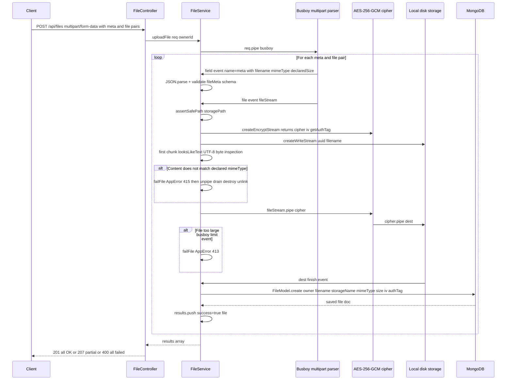

# File Upload Flow

```mermaid
sequenceDiagram
    participant C as Client
    participant FC as FileController
    participant FS as FileService
    participant BB as Busboy multipart parser
    participant Crypto as AES-256-GCM cipher
    participant Disk as Local disk storage
    participant DB as MongoDB

    C->>FC: POST /api/files multipart/form-data with meta and file pairs
    FC->>FS: uploadFile req ownerId
    FS->>BB: req.pipe busboy

    loop For each meta and file pair
        BB->>FS: field event name=meta with filename mimeType declaredSize
        FS->>FS: JSON.parse + validate fileMeta schema
        BB->>FS: file event fileStream
        FS->>FS: assertSafePath storagePath
        FS->>Crypto: createEncryptStream returns cipher iv getAuthTag
        FS->>Disk: createWriteStream uuid filename

        FS->>FS: first chunk looksLikeText UTF-8 byte inspection

        alt Content does not match declared mimeType
            FS->>FS: failFile AppError 415 then unpipe drain destroy unlink
        end

        FS->>Crypto: fileStream.pipe cipher
        Crypto->>Disk: cipher.pipe dest

        alt File too large busboy limit event
            FS->>FS: failFile AppError 413
        end

        Disk->>FS: dest finish event
        FS->>DB: FileModel.create owner filename storageName mimeType size iv authTag
        DB-->>FS: saved file doc
        FS->>FS: results.push success=true file
    end

    FS-->>FC: results array
    FC-->>C: 201 all OK or 207 partial or 400 all failed
```
