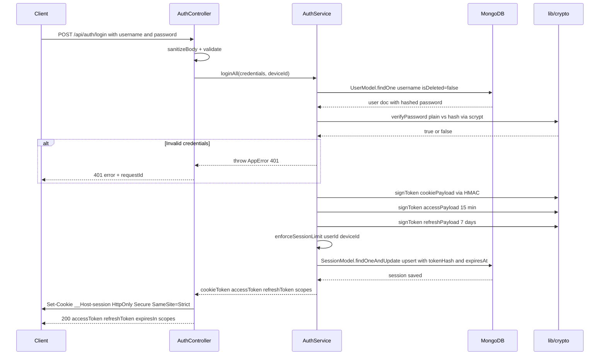

# Authentication Flow — Login

```mermaid
sequenceDiagram
    participant C as Client
    participant AC as AuthController
    participant AS as AuthService
    participant DB as MongoDB
    participant Crypto as lib/crypto

    C->>AC: POST /api/auth/login with username and password
    AC->>AC: sanitizeBody + validate
    AC->>AS: loginAll(credentials, deviceId)

    AS->>DB: UserModel.findOne username isDeleted=false
    DB-->>AS: user doc with hashed password
    AS->>Crypto: verifyPassword plain vs hash via scrypt
    Crypto-->>AS: true or false

    alt Invalid credentials
        AS-->>AC: throw AppError 401
        AC-->>C: 401 error + requestId
    end

    AS->>Crypto: signToken cookiePayload via HMAC
    AS->>Crypto: signToken accessPayload 15 min
    AS->>Crypto: signToken refreshPayload 7 days
    AS->>AS: enforceSessionLimit userId deviceId
    AS->>DB: SessionModel.findOneAndUpdate upsert with tokenHash and expiresAt
    DB-->>AS: session saved

    AS-->>AC: cookieToken accessToken refreshToken scopes
    AC->>C: Set-Cookie __Host-session HttpOnly Secure SameSite=Strict
    AC-->>C: 200 accessToken refreshToken expiresIn scopes
```
