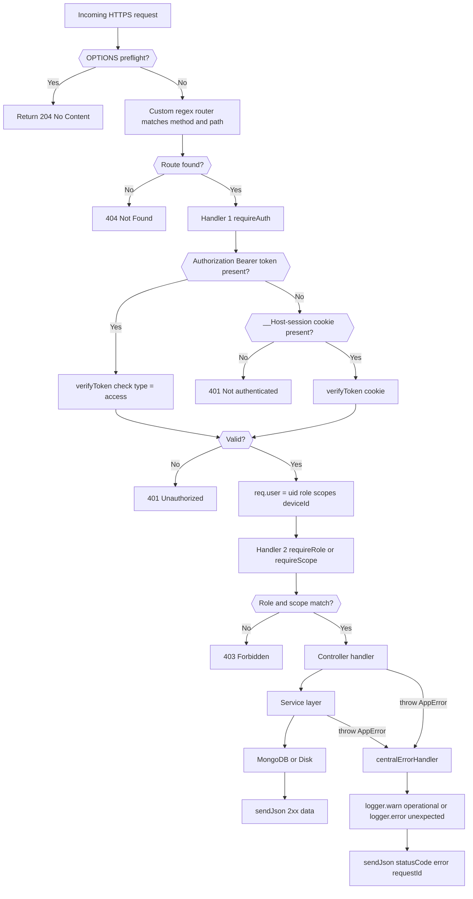

# Request Middleware Chain

```mermaid
flowchart TD
    Req["Incoming HTTPS request"] --> CORS

    CORS{{"OPTIONS preflight?"}}
    CORS -- Yes --> Return204["Return 204 No Content"]
    CORS -- No --> Router["Custom regex router matches method and path"]

    Router --> NotFound{{"Route found?"}}
    NotFound -- No --> Err404["404 Not Found"]
    NotFound -- Yes --> H1["Handler 1 requireAuth"]

    H1 --> BearerCheck{{"Authorization Bearer token present?"}}
    BearerCheck -- Yes --> VerifyAccess["verifyToken check type = access"]
    BearerCheck -- No --> CookieCheck{{"__Host-session cookie present?"}}
    CookieCheck -- No --> Err401A["401 Not authenticated"]
    CookieCheck -- Yes --> VerifyCookie["verifyToken cookie"]

    VerifyAccess --> TokenOK{{"Valid?"}}
    VerifyCookie --> TokenOK
    TokenOK -- No --> Err401B["401 Unauthorized"]
    TokenOK -- Yes --> SetUser["req.user = uid role scopes deviceId"]

    SetUser --> H2["Handler 2 requireRole or requireScope"]
    H2 --> Guard{{"Role and scope match?"}}
    Guard -- No --> Err403["403 Forbidden"]
    Guard -- Yes --> Controller["Controller handler"]

    Controller --> Service["Service layer"]
    Service --> DB["MongoDB or Disk"]
    DB --> Response["sendJson 2xx data"]

    Controller -->|"throw AppError"| EH["centralErrorHandler"]
    Service    -->|"throw AppError"| EH
    EH --> LogWarn["logger.warn operational or logger.error unexpected"]
    LogWarn --> ErrResponse["sendJson statusCode error requestId"]
```
