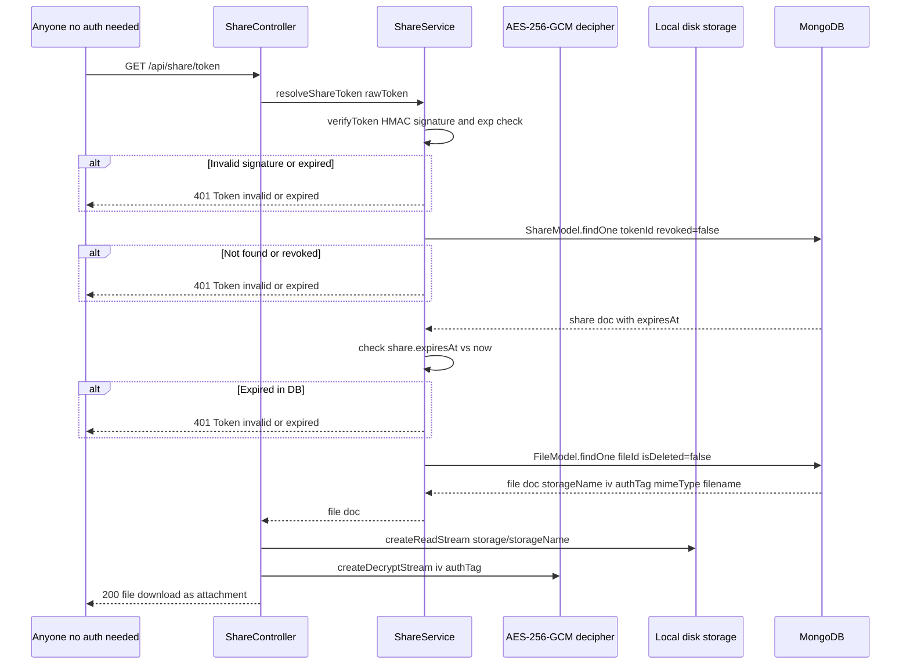

# File Download via Share Link

```mermaid
sequenceDiagram
    participant Anyone as Anyone no auth needed
    participant SC as ShareController
    participant SS as ShareService
    participant Crypto as AES-256-GCM decipher
    participant Disk as Local disk storage
    participant DB as MongoDB

    Anyone->>SC: GET /api/share/token
    SC->>SS: resolveShareToken rawToken

    SS->>SS: verifyToken HMAC signature and exp check

    alt Invalid signature or expired
        SS-->>Anyone: 401 Token invalid or expired
    end

    SS->>DB: ShareModel.findOne tokenId revoked=false

    alt Not found or revoked
        SS-->>Anyone: 401 Token invalid or expired
    end

    DB-->>SS: share doc with expiresAt
    SS->>SS: check share.expiresAt vs now

    alt Expired in DB
        SS-->>Anyone: 401 Token invalid or expired
    end

    SS->>DB: FileModel.findOne fileId isDeleted=false
    DB-->>SS: file doc storageName iv authTag mimeType filename
    SS-->>SC: file doc

    SC->>Disk: createReadStream storage/storageName
    SC->>Crypto: createDecryptStream iv authTag
    SC-->>Anyone: 200 file download as attachment
```
