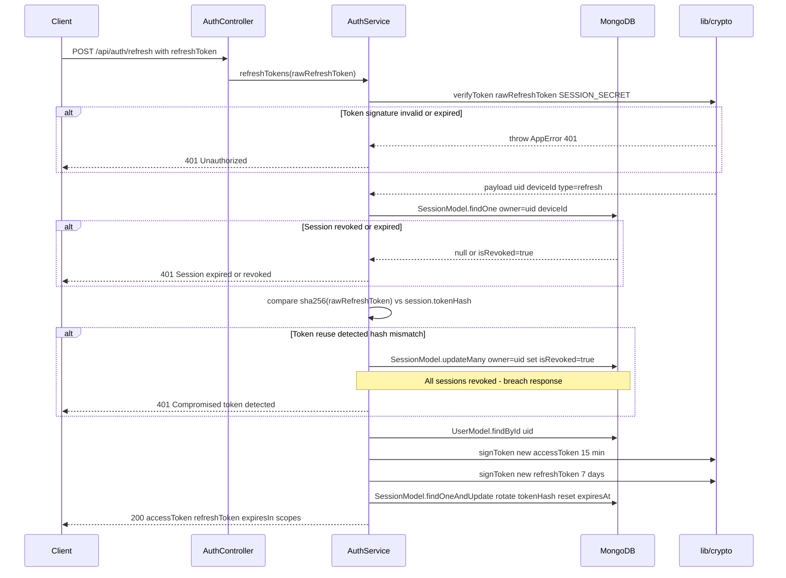

# Token Refresh & Reuse Detection

```mermaid
sequenceDiagram
    participant C as Client
    participant AC as AuthController
    participant AS as AuthService
    participant DB as MongoDB
    participant Crypto as lib/crypto

    C->>AC: POST /api/auth/refresh with refreshToken
    AC->>AS: refreshTokens(rawRefreshToken)
    AS->>Crypto: verifyToken rawRefreshToken SESSION_SECRET

    alt Token signature invalid or expired
        Crypto-->>AS: throw AppError 401
        AS-->>C: 401 Unauthorized
    end

    Crypto-->>AS: payload uid deviceId type=refresh
    AS->>DB: SessionModel.findOne owner=uid deviceId

    alt Session revoked or expired
        DB-->>AS: null or isRevoked=true
        AS-->>C: 401 Session expired or revoked
    end

    AS->>AS: compare sha256(rawRefreshToken) vs session.tokenHash

    alt Token reuse detected hash mismatch
        AS->>DB: SessionModel.updateMany owner=uid set isRevoked=true
        Note over AS,DB: All sessions revoked - breach response
        AS-->>C: 401 Compromised token detected
    end

    AS->>DB: UserModel.findById uid
    AS->>Crypto: signToken new accessToken 15 min
    AS->>Crypto: signToken new refreshToken 7 days
    AS->>DB: SessionModel.findOneAndUpdate rotate tokenHash reset expiresAt
    AS-->>C: 200 accessToken refreshToken expiresIn scopes
```
