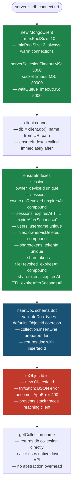
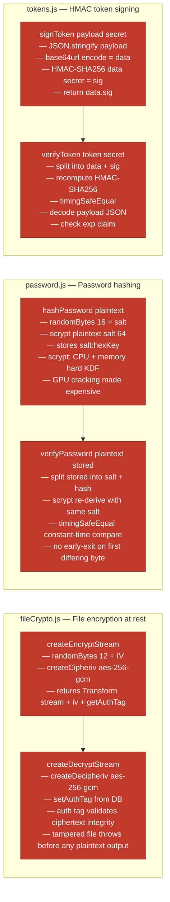
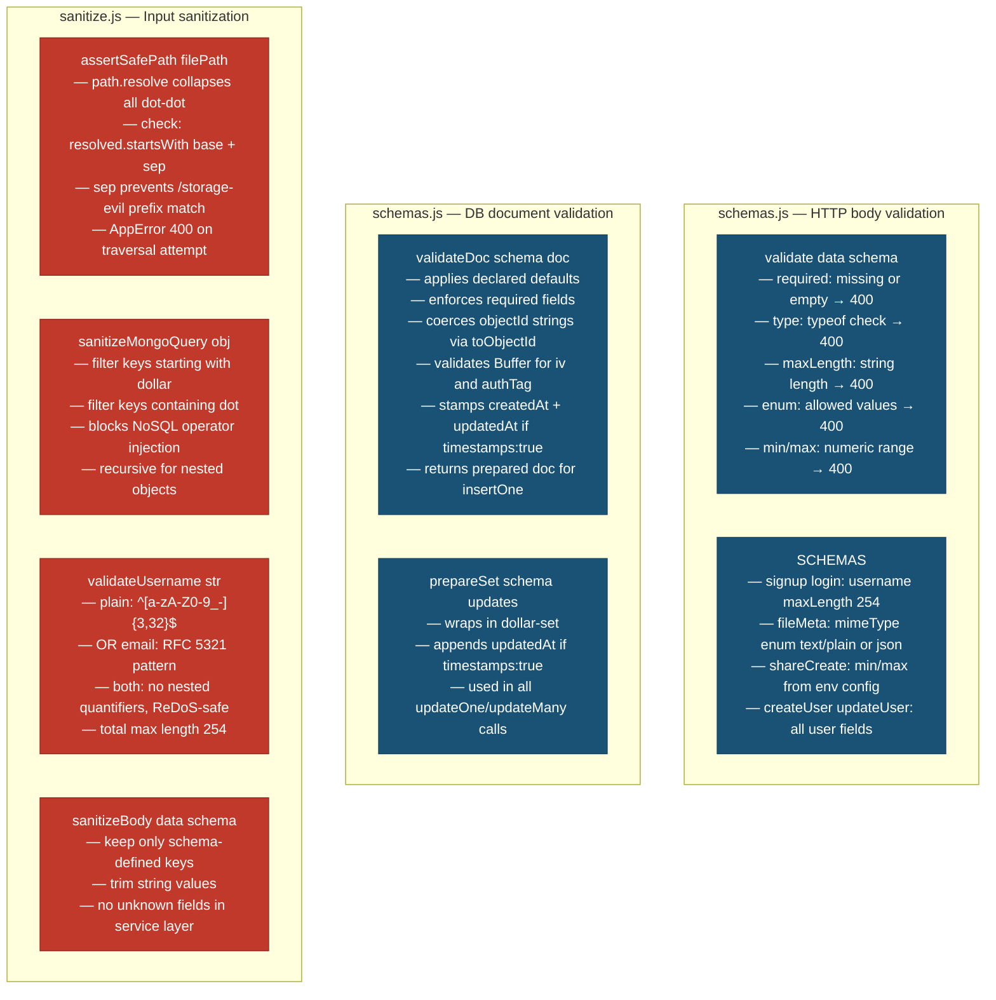
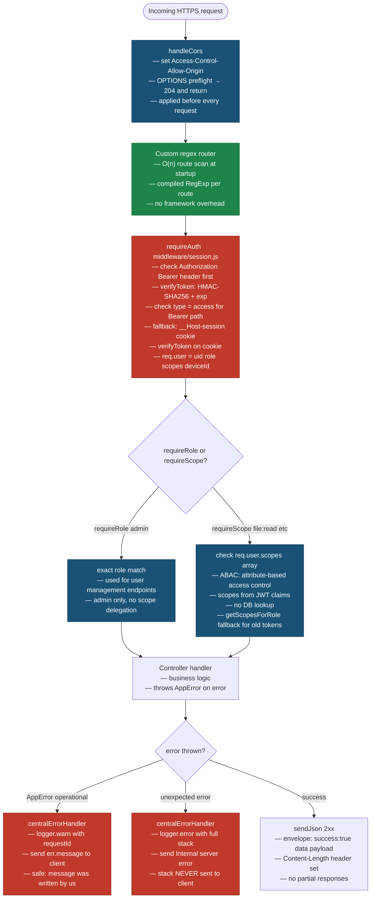
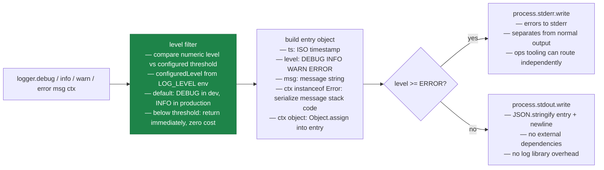

# Shared Infrastructure — HLD

> **Legend**
> - 🔴 Red nodes — Security controls
> - 🔵 Blue nodes — Validation / Input checks
> - 🟢 Green nodes — Performance decisions
> - White nodes — Business logic / happy path

---

## MongoDB Connection Layer (lib/db.js)

---

## Cryptography (lib/crypto/)

---

## Validation Layer (lib/validation/)

---

## Middleware Chain

---

## Logger (lib/logger.js)

