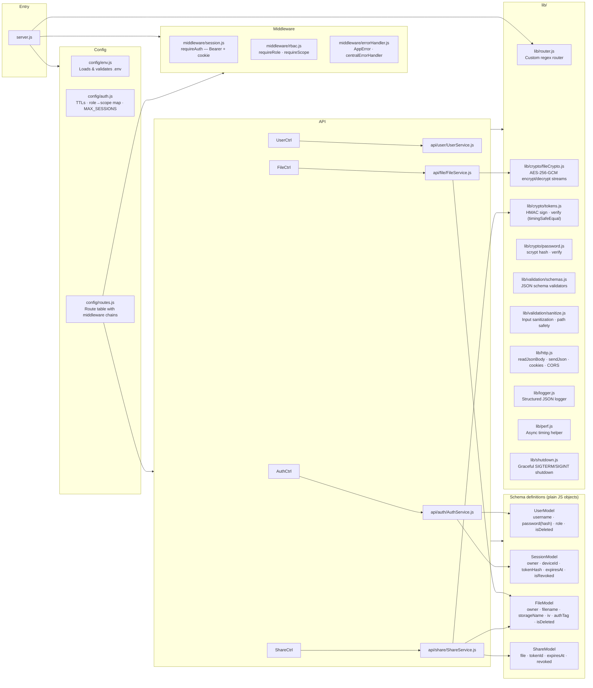

# Module / Layer Map

```mermaid
graph LR
    subgraph Entry
        server.js
    end

    subgraph Config
        env.js["config/env.js\nLoads & validates .env"]
        auth_cfg["config/auth.js\nTTLs · role→scope map · MAX_SESSIONS"]
        routes_cfg["config/routes.js\nRoute table with middleware chains"]
    end

    subgraph Middleware
        session_mw["middleware/session.js\nrequireAuth — Bearer + cookie"]
        rbac_mw["middleware/rbac.js\nrequireRole · requireScope"]
        err_mw["middleware/errorHandler.js\nAppError · centralErrorHandler"]
    end

    subgraph API
        AuthCtrl --> AuthSvc["api/auth/AuthService.js"]
        UserCtrl --> UserSvc["api/user/UserService.js"]
        FileCtrl --> FileSvc["api/file/FileService.js"]
        ShareCtrl --> ShareSvc["api/share/ShareService.js"]
    end

    subgraph Models["Schema definitions (plain JS objects)"]
        UserModel["UserModel\nusername · password(hash) · role · isDeleted"]
        SessionModel["SessionModel\nowner · deviceId · tokenHash · expiresAt · isRevoked"]
        FileModel["FileModel\nowner · filename · storageName · iv · authTag · isDeleted"]
        ShareModel["ShareModel\nfile · tokenId · expiresAt · revoked"]
    end

    subgraph LibLayer["lib/"]
        router_lib["lib/router.js\nCustom regex router"]
        fileCrypto["lib/crypto/fileCrypto.js\nAES-256-GCM encrypt/decrypt streams"]
        tokens_lib["lib/crypto/tokens.js\nHMAC sign · verify (timingSafeEqual)"]
        password_lib["lib/crypto/password.js\nscrypt hash · verify"]
        schemas_lib["lib/validation/schemas.js\nJSON schema validators"]
        sanitize_lib["lib/validation/sanitize.js\nInput sanitization · path safety"]
        http_lib["lib/http.js\nreadJsonBody · sendJson · cookies · CORS"]
        logger_lib["lib/logger.js\nStructured JSON logger"]
        perf_lib["lib/perf.js\nAsync timing helper"]
        shutdown_lib["lib/shutdown.js\nGraceful SIGTERM/SIGINT shutdown"]
    end

    server.js --> Config
    server.js --> Middleware
    server.js --> router_lib
    routes_cfg --> API
    routes_cfg --> Middleware
    API --> Models
    API --> LibLayer
    AuthSvc --> SessionModel
    AuthSvc --> UserModel
    FileSvc --> FileModel
    FileSvc --> fileCrypto
    ShareSvc --> ShareModel
    ShareSvc --> FileModel
    ShareSvc --> tokens_lib
```
