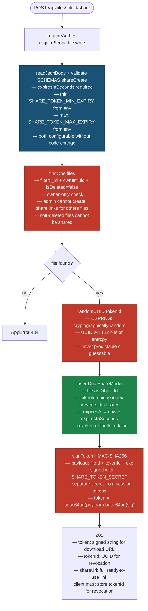
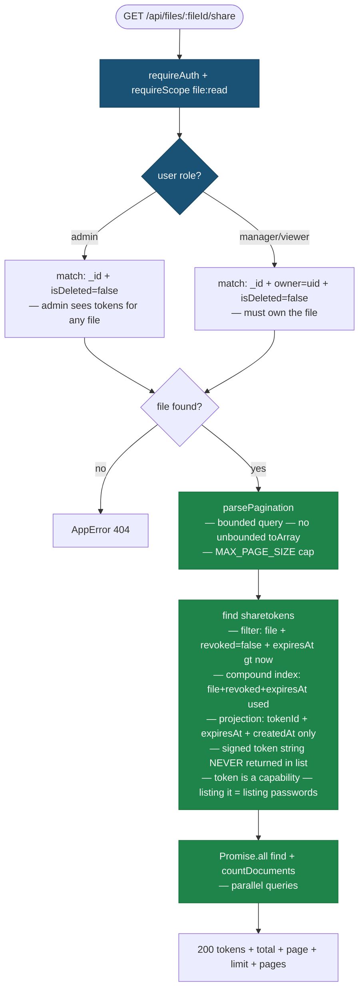
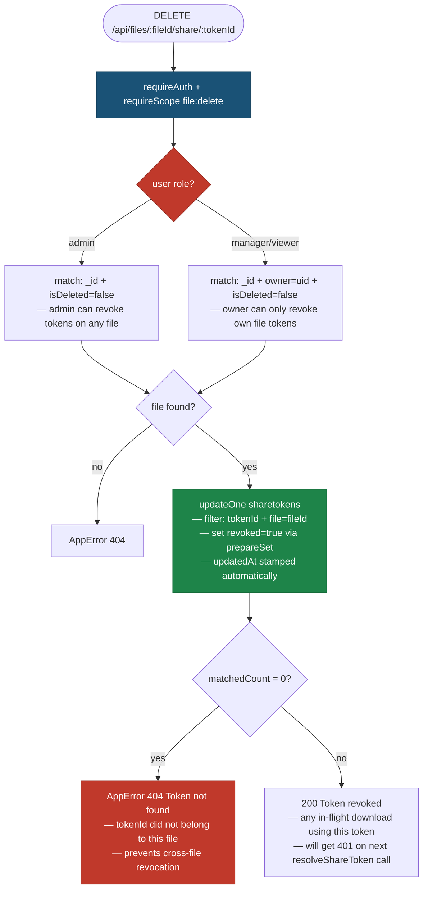
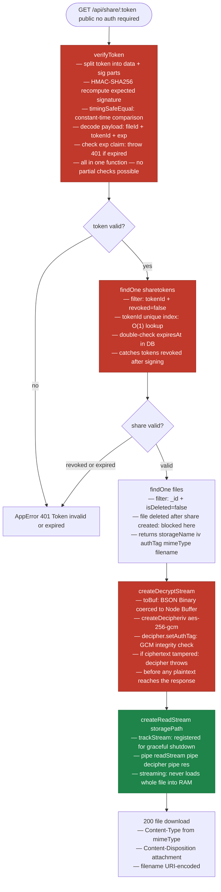

# Share Module — HLD

> **Legend**
> - 🔴 Red nodes — Security controls
> - 🔵 Blue nodes — Validation / Input checks
> - 🟢 Green nodes — Performance decisions
> - White nodes — Business logic / happy path

---

## Create Share Token

---

## List Share Tokens

---

## Revoke Share Token

---

## Download via Share Link

