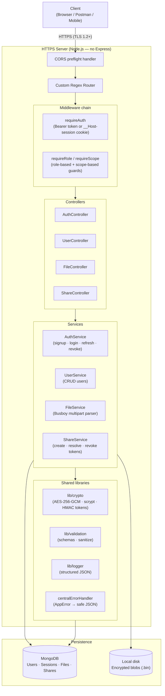

# System Overview

```mermaid
graph TB
    Client["Client\n(Browser / Postman / Mobile)"]

    subgraph Server["HTTPS Server (Node.js — no Express)"]
        CORS["CORS preflight handler"]
        Router["Custom Regex Router"]

        subgraph Middleware["Middleware chain"]
            Auth["requireAuth\n(Bearer token or __Host-session cookie)"]
            RBAC["requireRole / requireScope\n(role-based + scope-based guards)"]
        end

        subgraph Controllers
            AuthCtrl["AuthController"]
            UserCtrl["UserController"]
            FileCtrl["FileController"]
            ShareCtrl["ShareController"]
        end

        subgraph Services
            AuthSvc["AuthService\n(signup · login · refresh · revoke)"]
            UserSvc["UserService\n(CRUD users)"]
            FileSvc["FileService\n(Busboy multipart parser)"]
            ShareSvc["ShareService\n(create · resolve · revoke tokens)"]
        end

        subgraph Libs["Shared libraries"]
            Crypto["lib/crypto\n(AES-256-GCM · scrypt · HMAC tokens)"]
            Validation["lib/validation\n(schemas · sanitize)"]
            Logger["lib/logger\n(structured JSON)"]
            ErrHandler["centralErrorHandler\n(AppError → safe JSON)"]
        end
    end

    subgraph Persistence
        MongoDB[("MongoDB\nUsers · Sessions · Files · Shares")]
        Disk[("Local disk\nEncrypted blobs (.bin)")]
    end

    Client -->|"HTTPS (TLS 1.2+)"| CORS
    CORS --> Router
    Router --> Middleware
    Middleware --> Controllers
    Controllers --> Services
    Services --> Libs
    Services --> MongoDB
    Services --> Disk
    Libs --> MongoDB
```
