# Session & Token Lifetime

```mermaid
gantt
    title Token and session lifetimes (not to scale)
    dateFormat X
    axisFormat %s

    section Bearer path
    Access token 15 min      : 0, 900
    Refresh token 7 days     : 0, 604800

    section Cookie path
    Session cookie 8 hours   : 0, 28800
```

- **Access token** — stateless JWT-like HMAC token; no DB lookup on every request.
- **Refresh token** — DB-backed; SHA-256 hash stored in `SessionModel`. Token rotation on every use.
- **Cookie token** — long-lived, same secret as access token; verified entirely from signature.
- **Session cap** — `MAX_SESSIONS = 2` per user. Oldest session is evicted when cap is reached.
- **Reuse detection** — if a refresh token is used twice, all sessions for that user are immediately revoked.
