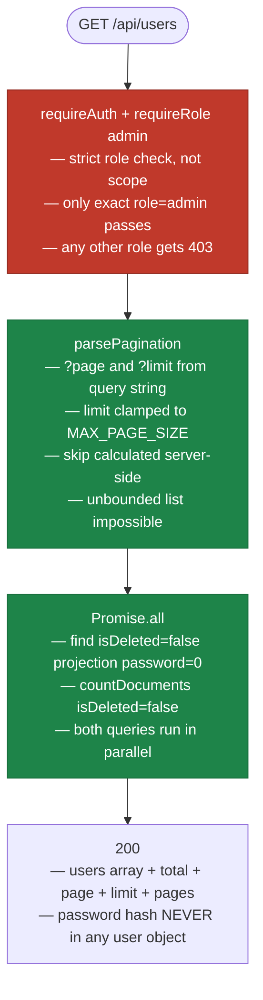
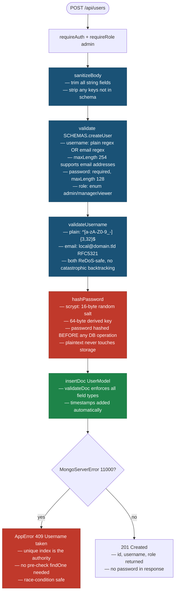
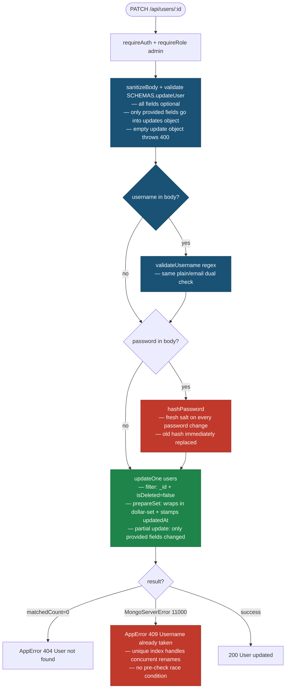
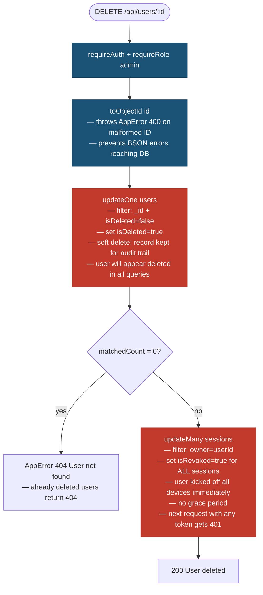

# User Module — HLD

> **Legend**
> - 🔴 Red nodes — Security controls
> - 🔵 Blue nodes — Validation / Input checks
> - 🟢 Green nodes — Performance decisions
> - White nodes — Business logic / happy path

---

## List Users

---

## Create User

---

## Update User

---

## Delete User

